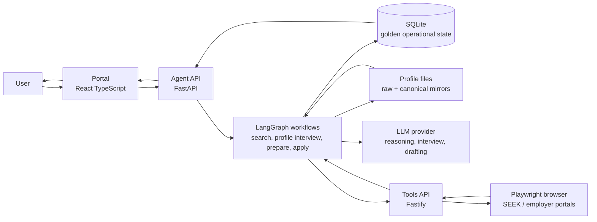
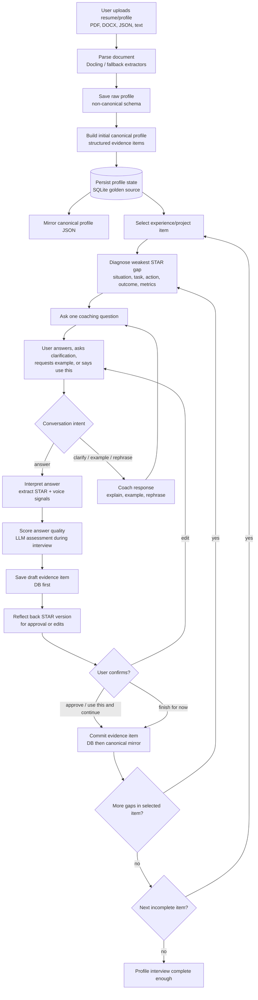
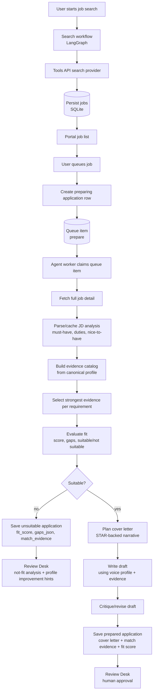
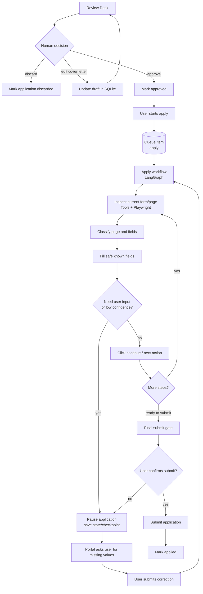
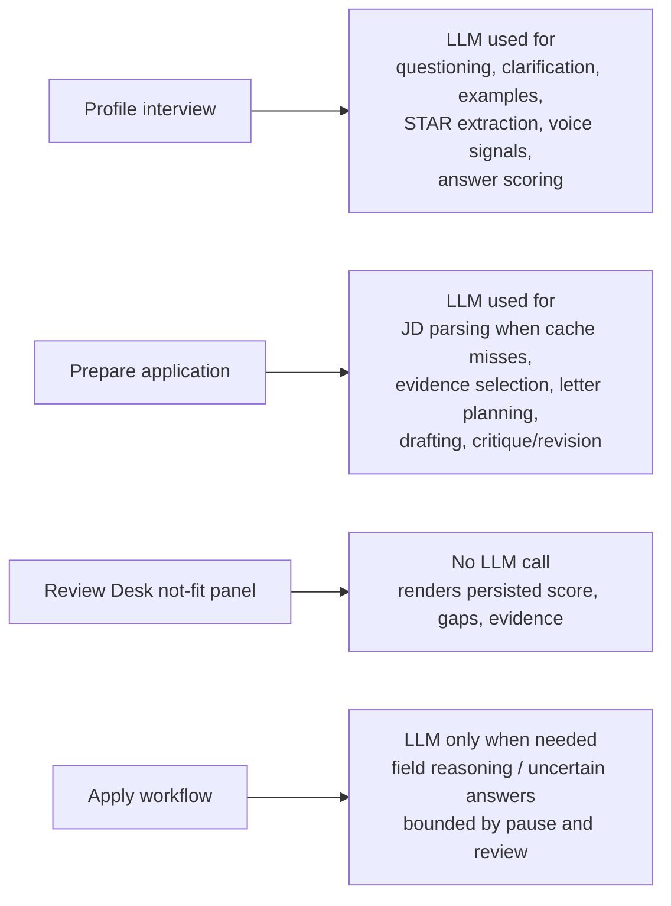
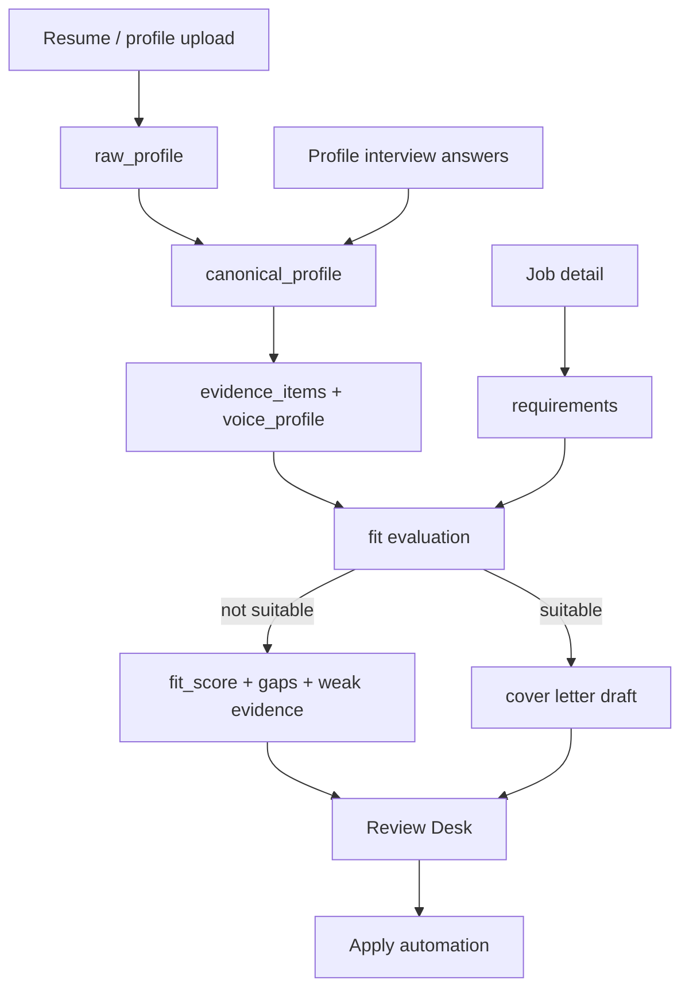

# Envoy End-to-End Flow

Envoy is a local, review-first job application co-pilot. It turns a user's resume/profile into a canonical evidence store, uses that evidence to assess jobs, prepares grounded cover letters, and automates application forms only after human review.

## 1. System Overview

Primary ownership:

- `portal/` owns UI, review, and user actions.
- `agent/` owns orchestration, state, LLM reasoning, persistence, and API contracts.
- `tools/` owns browser automation and provider-specific page interaction.
- SQLite is the golden operational source for sessions, applications, queues, drafts, fit metadata, and persisted profile state.
- Profile JSON files are mirrors/artifacts for inspectability and compatibility.

## 2. Profile Creation And Enrichment

Important behavior:

- The interview is intentionally conversational, not a static form.
- The user can select any experience/project and rerun the interview on it.
- Saved STAR answers go to SQLite first, then canonical JSON is updated as a mirror.
- The LLM is used during interview for coaching, interpretation, STAR synthesis, voice extraction, and answer-quality scoring.
- The deterministic completeness score and LLM answer-quality score are separate signals.

## 3. Job Discovery And Prepare Flow

Fit metadata shown in the UI:

- `fit_score`: exact score from the prepare graph when available.
- `gaps_json`: blocking requirements that made the role weak or unsuitable.
- `match_evidence`: `[STRONG|MODERATE|WEAK] requirement -> evidence` lines.
- Review Desk can render this without an extra LLM call because the prepare workflow already produced it.

## 4. Review And Apply Flow

Apply workflow principles:

- Browser/provider logic stays in `tools/`.
- LangGraph owns state, decisions, pauses, and resumes.
- Portal owns human confirmation.
- SQLite keeps queue state, application state, drafts, apply-step state, and user-corrected answers.

## 5. LLM Call Map

The important cost boundary is that Review Desk analysis should not call the LLM just because a user opens a job. It reads persisted outputs from the prepare workflow.

## 6. Data Flow Summary

Downstream quality depends most on canonical profile evidence quality. Weak STAR items produce weak fit matches, weak cover letters, and more not-fit outcomes.
