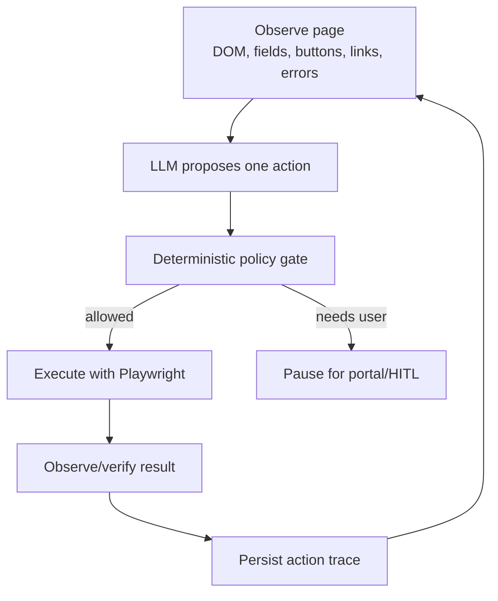

# Envoy External Apply Harness

This document tracks the custom harness for applying on external employer sites where fixed provider parsers are not enough.

## Pattern

Envoy uses a checkpointed observe-plan-act loop:



The LLM does not directly operate the browser. It proposes one structured action. Envoy validates and executes.

## External Control Architecture

The external browser stack should be generic control-pattern automation, not portal-specific flow automation. Workday, Greenhouse, Lever, SuccessFactors, and other ATS portals can provide useful pressure tests and small hints, but action execution should be driven by observed control behavior.

The intended loop is:

1. Observe the page and classify controls.
2. Plan the value or command using profile facts, approved memory, and page context.
3. Select an interaction strategy based on control metadata.
4. Execute the action.
5. Verify that the value or navigation actually stuck.
6. Recover from validation errors when the answer is known, and pause only for missing authority or information.

`field_type` remains the stable planner-facing action category: text, select, radio, checkbox, file, and related browser-safe types. `control_kind` is the lower-level browser interaction hint used by the executor. Examples include:

- `native_text`
- `native_select`
- `native_checkbox`
- `native_radio_group`
- `aria_checkbox`
- `aria_radio_group`
- `aria_combobox`
- `button_listbox`
- `prompt_select`
- `file_upload`

Portal-specific code should be limited to classification or strategy ordering. For example, a Workday prompt select should still be represented as a generic `prompt_select` or `button_listbox` control. The executor may prioritize an owned-listbox strategy when a portal is known to use portaled listboxes, but it should not fork the whole apply flow by ATS.

### Strategy Direction

`executeExternalApplyAction(...)` remains the public tools endpoint, but the implementation should move toward small strategy modules:

- target resolution
- text controls
- select/listbox/combobox controls
- checkbox and radio controls
- file uploads
- click/navigation controls
- post-action verification
- diagnostics and artifact capture

Each strategy should answer four questions: can it handle this control, how does it interact, how does it verify success, and what diagnostics does it emit when it fails.

### Verification And Recovery

Autonomy depends on verification more than clicks. Every action should converge on the same contract:

```text
resolve target -> interact -> verify -> observe errors -> return structured result
```

For selects, verification may use display text, selected option state, hidden input value, or a fresh observation. For text fields, verification should check the input value and any visible validation error. For submit/save clicks, the harness should detect whether navigation advanced; if the page stayed put, it should map validation errors back to fields and repair known answers before asking the user.

### Migration Plan

1. Add `control_kind` metadata to observations while preserving `field_type`.
2. Extract select/dropdown behavior into a generic select control module.
3. Convert current Workday-derived handling into generic owned-listbox, visible-listbox, prompt-select, and searchable-combobox strategies.
4. Make action verification results explicit and shared across strategies.
5. Add validation repair after save/continue clicks.
6. Promote approved answers and profile defaults into a durable answer-memory layer.

## Provider Routing Contract

Apply starts with a provider launch step, then branches by where the provider sends the browser:

- SEEK hosted apply: continue through the existing deterministic SEEK inspector, answer proposal, fill, and submit-gate flow.
- SEEK job that redirects to an employer/ATS portal: switch to the external apply harness.
- Providers without a hosted-apply parser yet, such as LinkedIn and Indeed: open the job URL and treat the page as an external harness entry point.
- Final submit remains human-gated for every provider and every external portal.

This keeps stable provider-native flows fast while using the generic harness only when fixed parsing is not reliable enough.

## Phase Plan

1. **Contracts and state models**
   - Define `PageObservation`, `ObservedField`, `ObservedAction`, `ProposedAction`, `ActionResult`, `ActionTrace`, `UserQuestion`, and `ExternalApplyState`.
   - Keep schemas strict enough to test and audit.

2. **Browser observation tool**
   - Add a provider-agnostic tools endpoint that turns the current browser page into `PageObservation`.
   - Include stable temporary `element_id` values for future action calls.
   - Extract fields, buttons, links, upload inputs, visible text, errors, and deterministic page type hints.

3. **Action tools**
   - Add narrow Playwright actions: fill text, select option, checkbox/radio, upload file, click.
   - Execute by `element_id`, not freeform selectors.
   - Treat resume/CV upload as a planner-selected tool call: the harness supplies the configured file path, the planner chooses `upload_file`, the policy validates the target and path, and the browser executor performs the upload.

4. **Planner**
   - Call the LLM with page observation, a compact `PlanningFrame`, available profile facts, approved memory, recent action trace, and the allowed action schema.
   - Require exactly one proposed action.
   - Keep the system prompt stable and generic; put situational guidance such as account recovery, manual-entry preference, upload availability, and blocked retries into structured JSON context.

4C. **Memory context**
   - Derive a compact `ExternalApplyMemoryContext` before each planner call.
   - Include portal host, account mode, rejected saved-login state, create-account availability, rejected attempts, and concrete recommendations.
   - Derive a `PlanningFrame` from the observation plus memory context before each planner call.
   - Include phase, objective, strategies, hints, recommended actions, blocked actions, and safety notes in the LLM payload.
   - Reuse approved external answers from `question_answer_cache` as planner `approved_memory`.
   - Persist successful user-supplied external field answers back to `question_answer_cache` with source `human_external`.
   - Keep recovery routing deterministic only where it prevents loops or unsafe repeats: if saved login was rejected and create-account/register is visible, choose account creation instead of retrying or asking for the same password again.

5. **Policy gate**
   - Auto-allow low-risk profile-backed fields.
   - Allow profile-backed resume uploads only when the target is an observed resume/CV file upload and the file path matches the configured `profile_facts.resume_path`.
   - Pause for salary, work rights ambiguity, legal declarations, diversity questions, low confidence, and final submit.

6. **LangGraph integration**
   - Existing apply workflow calls one harness step at a time.
   - Persist every observation, proposed action, policy decision, and result.
   - Use portal/HITL interrupts for user input and final submit.

## Current Status

- Phase 1 is implemented in `agent/app/state/external_apply.py`.
- Phase 2 is started with `POST /tools/browser/observe_external_apply`.
- Agent-side typed wrapper is available as `observe_external_apply(...)` in `agent/app/tools/browser_client.py`.
- Phase 3 is started with `POST /tools/browser/execute_external_apply_action`.
- Action execution is still one action per call and only supports observed `element_id` targets.
- Phase 4A is started in `agent/app/services/external_apply_ai.py`.
- The planner builds a JSON-only prompt, parses one `ProposedAction`, rejects unknown `element_id`s, and falls back conservatively when the LLM is unavailable.
- Phase 4B is started in `agent/app/services/external_apply_harness.py`.
- The harness can now observe a page, call the planner, and return `ExternalApplyState` without executing the proposed action.
- Phase 4C is started with `ExternalApplyMemoryContext`.
- The harness now summarizes portal/account state before planning, builds a structured `PlanningFrame`, injects cache-backed approved answers into external apply planning, saves successful user field answers to the shared question cache, and deterministically prefers create-account only when a saved portal login was rejected.
- The planner prompt is now a stable generic contract; page-specific guidance is carried as JSON planning context instead of accumulating page-specific prose in the system prompt.
- Planner-owned upload is in place: observations expose upload inputs, prompts describe `upload_file`, deterministic fallback handles obvious resume/CV inputs only, and policy blocks profile resume uploads to non-resume document fields or missing files.
- Phase 5 is started in `agent/app/services/external_apply_policy.py`.
- The policy gate returns `allowed`, `paused`, or `rejected` before any proposed browser action can execute.
- Phase 6 is started with `run_external_apply_step(...)` in `agent/app/services/external_apply_harness.py`.
- One loop step now performs observe → plan → policy → execute-if-allowed and records an `ActionTrace`.
